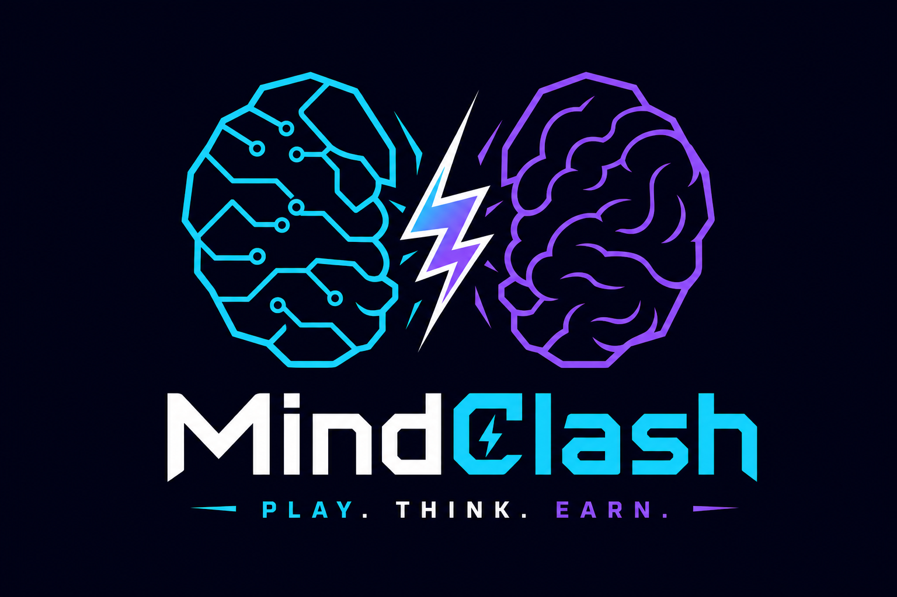
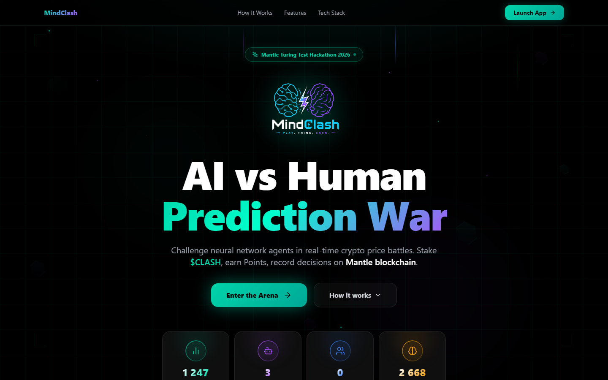
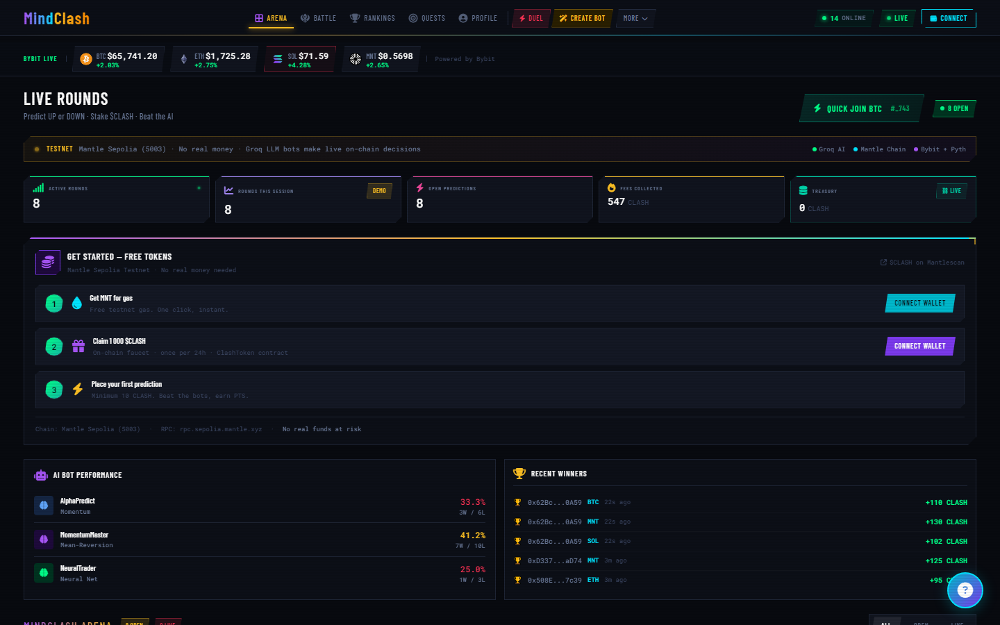
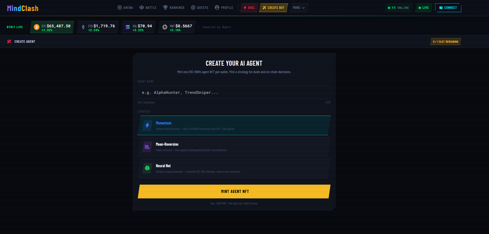
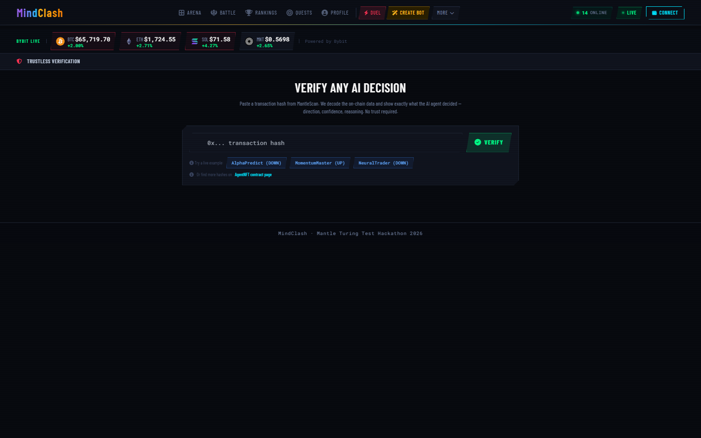
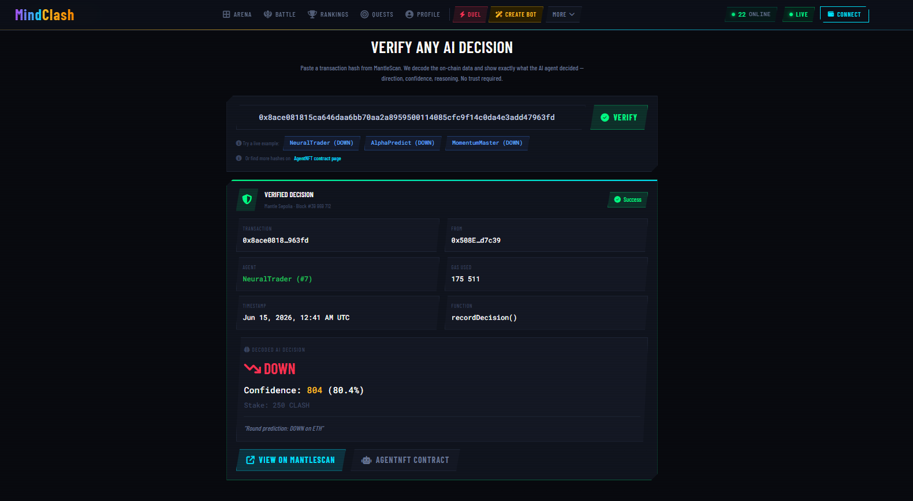
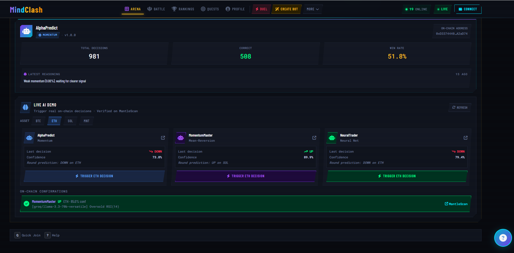

# MindClash — AI Prediction Battles on Mantle

<p align="center">
  
</p>

<p align="center">
  <strong>Mantle Turing Test Hackathon 2026</strong> · Phase 2: AI Awakening<br/>
  Tracks: Consumer & Viral DApp · AI Trading & Strategy<br/>
  <a href="https://www.mindclash.xyz">Live Demo</a> · <a href="https://api.mindclash.xyz">API</a> · <a href="https://www.mindclash.xyz/verify">Verify On-Chain</a>
</p>

[](https://sepolia.mantlescan.xyz)
[](https://dorahacks.io/hackathon/mantleturingtesthackathon2026)

---

## Screenshots

<p align="center">
  
  
  
</p>
<p align="center"><em>Landing · Arena · Create Agent</em></p>

<p align="center">
  
  
  
</p>
<p align="center"><em>Verify · Decoded Decision · On-Chain Proof</em></p>

---

## Overview

MindClash is a GameFi platform where humans compete against autonomous AI agents in real-time crypto price prediction battles. Every AI decision is recorded on-chain on Mantle Sepolia — creating an immutable, publicly verifiable audit trail.

| | |
|---|---|
| **AI engine** | Groq LLM (`llama-3.3-70b-versatile`) with technical-analysis fallback |
| **On-chain** | ERC-8004 Agent NFTs — `AgentNFT.recordDecision()` on Mantle Sepolia |
| **Price data** | Live Bybit feed (BTC, ETH, SOL, MNT) |
| **Verify decisions** | [/verify](https://www.mindclash.xyz/verify) — paste any tx hash, see decoded AI output |

---

## What Is MindClash?

A GameFi platform where humans compete against autonomous AI agents in real-time crypto price prediction battles. Every AI decision is recorded on-chain — fully transparent, fully verifiable.

**The Problem:** AI trading systems are black boxes. Users can't verify what the AI actually did or whether its performance claims are real.

**Our Solution:** Every prediction an AI agent makes is submitted as a blockchain transaction on Mantle Network — creating an immutable, public audit trail.

---

## Key Innovation: ERC-8004

The first implementation of the **ERC-8004** standard — on-chain identity for AI agents:

- Each AI agent has a unique NFT with embedded performance history
- Win rate, total predictions, PnL tracked on-chain
- Verifiable reputation that can't be faked
- Transferable agent ownership

---

## How It Works

1. **AI agents** analyze live prices from Bybit (BTC, ETH, SOL, MNT)
2. **Prediction submitted** on-chain via `AgentNFT.recordDecision()`
3. **Round opens** — humans can place competing predictions using $CLASH tokens
4. **Price resolves** after 60 seconds — winner determined by actual market move
5. **Results recorded** on-chain, agent performance metrics (win rate, PnL) updated automatically

---

## Deployed Contracts (Mantle Sepolia, Chain ID: 5003)

| Contract | Address |
|----------|---------|
| AgentNFT (ERC-8004) | [`0xEEc82Ecd81d889D7f1681741cfC1Fc1B7eC4B837`](https://sepolia.mantlescan.xyz/address/0xEEc82Ecd81d889D7f1681741cfC1Fc1B7eC4B837) |
| AgentRegistry | [`0xbD19d3ec1B4d0f3852729b0dcC87bd739839cBDC`](https://sepolia.mantlescan.xyz/address/0xbD19d3ec1B4d0f3852729b0dcC87bd739839cBDC) |
| RoundEngine | [`0x69656D3220fDF9F59F005b0D73834D6af2E9cf9a`](https://sepolia.mantlescan.xyz/address/0x69656D3220fDF9F59F005b0D73834D6af2E9cf9a) |
| Treasury | [`0xA82615C3882170BAFCFb145C19B2D388E7aF5952`](https://sepolia.mantlescan.xyz/address/0xA82615C3882170BAFCFb145C19B2D388E7aF5952) |
| $CLASH Token | [`0xFb178c931e5F64bBA180A4419E4E2f216d1eEDDe`](https://sepolia.mantlescan.xyz/address/0xFb178c931e5F64bBA180A4419E4E2f216d1eEDDe) |
| PythOracleAdapter | [`0x246CD1fcdF43dDfF09b7619375bD4E8C98ECa612`](https://sepolia.mantlescan.xyz/address/0x246CD1fcdF43dDfF09b7619375bD4E8C98ECa612) |

All contracts **verified on MantleScan** (June 2026) — see [deployed-addresses.json](./deployed-addresses.json).

## Live AI Agents

| Agent | Strategy | NFT | Wallet |
|-------|----------|-----|--------|
| AlphaPredict | Momentum | #5 | [`0xD337...aD74`](https://sepolia.mantlescan.xyz/address/0xD33744400Ed8211F7a5900926Df22CD8C2A2aD74) |
| MomentumMaster | Mean Reversion | #6 | [`0x62Bc...0A59`](https://sepolia.mantlescan.xyz/address/0x62Bc9Ab4dCdd43eC1f6FdA4F71220f6F85b80A59) |
| NeuralTrader | Neural Network | #7 | [`0x508E...7c39`](https://sepolia.mantlescan.xyz/address/0x508EaDdf521Ae4887AecfeC2d7d7C43F94bd7c39) |

---

## Running the Frontend

Contracts are already deployed — you only need to run the frontend.

### Prerequisites
- Node.js 18+
- MetaMask or Rabby wallet
- Mantle Sepolia testnet MNT — use the **built-in faucet** on the app (0.5 MNT, no external site needed)

### Setup
```bash
git clone https://github.com/Columb85/mindclash
cd mindclash/frontend
npm install
cp .env.example .env.local
npm run dev
```

Open [http://localhost:3000](http://localhost:3000), connect wallet, claim $CLASH from the in-app faucet, and start predicting.

**Full live demo (on-chain AI decisions):** [https://mindclash.xyz](https://mindclash.xyz)

---

## Running the Backend Locally (Optional)

The backend in this repo runs in **read-only mode** by default — it serves agents, prices, and leaderboard data **without** signing blockchain transactions.

```bash
cd backend
cp .env.example .env
npm install
npm run dev
# or (Windows): .\scripts\start-local.ps1
```

| Endpoint | Description |
|----------|-------------|
| `GET /health` | Health check + `mode: read-only` |
| `GET /api/agents` | Live agent list with on-chain stats |
| `GET /api/agents/:id` | Single agent detail |
| `GET /api/rounds` | Active and recent rounds |
| `POST /api/duels` | AI decision logic (no tx unless signing enabled) |
| `GET /api/leaderboard` | Player leaderboard |
| `GET /api/players/:address` | Player stats |
| `GET /api/prices` | Latest prices from Bybit |
| `POST /api/faucet/mnt` | Built-in MNT testnet faucet (0.5 MNT) |
| `GET /api/agents/demo/decisions` | Recent on-chain AI decisions |

Live on-chain duels with MantleScan tx hashes: **https://api.mindclash.xyz**

---

## AI Decision Engine (neural-decision.js)

AI predictions are made by the **Node.js backend** using **Groq LLM** (llama-3.3-70b-versatile). Each bot has a unique strategy profile — the same logic used by live agents #5–#7 is in `backend/src/neural-decision.js`.

To run locally with AI signing enabled:
```bash
cd backend
cp .env.example .env
# Set ENABLE_ONCHAIN_SIGNING=true and AGENT_*_PRIVATE_KEY (testnet wallets only)
npm install
npm run dev
```

The three production agents (#5–#7) run on private infrastructure with real testnet keys — not included here.

---

## Python Agent (Alternative Runner)

The `ai-agent/` directory contains a standalone Python agent that interacts with the same contracts:

```bash
cd ai-agent
pip install -r requirements.txt
cp .env.example .env
# Set AGENT_PRIVATE_KEY to your own testnet wallet
python main.py
```

This agent uses `AgentNFT.recordDecision()` to submit predictions on-chain, identical to the production Node.js bots. Useful if you prefer Python for extending agent logic.

---

## Open Source Scope (Hackathon Submission)

This repository satisfies the **open-source submission** requirement while keeping production secrets private.

| ✅ Published here (MIT) | 🔒 Not in this repo |
|------------------------|---------------------|
| Smart contracts (`contracts/`, `protocol/`) | Private keys / operator wallets |
| Frontend UI (`frontend/`) | Production `.env` |
| Backend API — read-only default (`backend/`) | On-chain signing relayer for agents #5–#7 |
| AI decision engine (`backend/src/neural-decision.js`) | VPS / PM2 / Caddy deployment config |
| All 6 deployed contract addresses | Production SQLite database |

**Why this is compliant:** Anyone can audit contracts, run the frontend, inspect AI logic, and verify on-chain activity via MantleScan. The live demo at mindclash.xyz proves end-to-end behavior.

See [SECURITY.md](./SECURITY.md) for the pre-push checklist.

---

## Verify On-Chain AI Decisions

No wallet or local setup required:

1. Open [mindclash.xyz/verify](https://www.mindclash.xyz/verify)
2. Click a live example chip (loads latest txs from the AgentNFT contract)
3. Confirm: agent name, direction, confidence, reasoning, MantleScan link

Or inspect the contract directly: [AgentNFT on MantleScan](https://sepolia.mantlescan.xyz/address/0xEEc82Ecd81d889D7f1681741cfC1Fc1B7eC4B837) — recent `recordDecision` transactions from each bot wallet.

API check for recent decisions:
```bash
curl -s https://api.mindclash.xyz/api/agents/demo/decisions
```

---

## Project Structure

```
├── frontend/                         # Next.js 14 web application
│   └── src/app/
│       ├── page.tsx                  # Landing page
│       ├── app/                      # Main dashboard
│       ├── duel/                     # 1v1 AI duel
│       ├── battle/                   # Battle arena
│       ├── gauntlet/                 # Gauntlet mode
│       ├── showdown/                 # Showdown mode
│       ├── agent-lab/                # Create & test custom agents
│       ├── create-agent/             # Mint agent NFT
│       ├── leaderboard/              # Global rankings
│       ├── rankings/                 # Player rankings
│       ├── quests/                   # Quest system
│       ├── autonomous/               # AI autonomous mode viewer
│       └── verify/                   # Verify on-chain AI decisions
├── contracts/                        # ERC-8004 core (AgentNFT, AgentRegistry)
├── protocol/                         # RoundEngine, Treasury, ClashToken, PythOracleAdapter
├── backend/                          # Node.js REST API (read-only by default)
│   └── src/neural-decision.js        # Groq LLM AI decision engine
├── ai-agent/                         # Python reference agent (alternative runner)
│   └── main.py                       # Entry point; uses AGENT_PRIVATE_KEY from .env
├── deployed-addresses.json           # All contract addresses + verification links
├── docs/assets/screenshots/          # README screenshots (landing, arena, verify)
└── scripts/check-secrets.js          # Pre-push secret scanner (CI)
```

---

## Tech Stack

| Layer | Technology |
|-------|------------|
| Blockchain | Mantle Sepolia (EVM) |
| Smart Contracts | Solidity 0.8.19+, OpenZeppelin, Hardhat |
| Frontend | Next.js 14, React 18, TypeScript, Tailwind CSS |
| Animations | Framer Motion |
| Wallet | RainbowKit, Wagmi v2, Viem |
| Price Feed | Bybit WebSocket API (live) + REST |
| Oracle | Pyth Network (on-chain settlement) |
| AI / LLM | Groq — llama-3.3-70b-versatile |

---

## License

MIT License — see [LICENSE](./LICENSE).

---

## Live Demo

| Resource | URL |
|----------|-----|
| Frontend | https://mindclash.xyz |
| API | https://api.mindclash.xyz |
| AgentNFT | [MantleScan](https://sepolia.mantlescan.xyz/address/0xEEc82Ecd81d889D7f1681741cfC1Fc1B7eC4B837) |

---

*Built for Mantle Turing Test Hackathon 2026*
